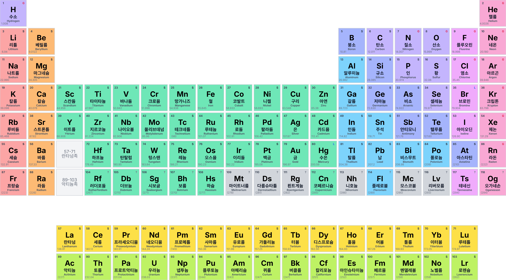

# InteractivePeriodicTable

[en](README.en.md)

## 개요

이 사이트는 주기율표 **커스텀**을 위해 설계된 웹 인터랙티브 도구입니다.

## 주요 기능

### 1. 주기율표 데이터

* **원소 데이터:** 각 원소의 원자 번호, 기호, 영어/한국어 이름, 원자량, 분류, 상온 상태(STP) 상태를 포함하는 데이터 세트를 기반으로 합니다.

### 2. 레이아웃 편집기

수소(H) 원소를 예시로 각 항목의 속성을 수정할 수 있는 편집기가 제공됩니다.

* **위치 편집:** 원소 블록 내부 항목(원자 번호, 기호, 이름, 원자량, 상태 표시)를 쉽게 드래그하여 이동시켜 원소 블록 내에서의 정확한 위치를 변경할 수 있습니다.
* **속성 편집:** 각 항목의 폰트 크기, 색상, **Bold**/*Italic* 스타일, 글꼴을 편집할 수 있습니다. 또한 표시 여부도 선택할 수 있습니다.
* * **다중 선택:** 여러 항목을 ctrl을 눌러 동시에 선택하여 한꺼번에 스타일을 변경할 수 있습니다.

### 3. 표시 및 색상 디자인

* **상태 표시:** STP 상태(기체, 액체, 고체, 미지)를 나타내는 기호('G', 'L', 'S', '?')와 해당 텍스트 색상을 변경할 수 있습니다.
* **분류 색상:** 모든 원소 분류(알칼리 금속, 전이 금속, 준금속 등)에 대한 배경 색상을 직접 정하거나 분류 자체를 끌 수 있습니다.

### 4. 내보내기

위 방법으로 편집한 주기율표 디자인을 내보낼 수 있습니다.

* **지원 형식:** PNG 이미지, JPEG 이미지, PDF 문서

